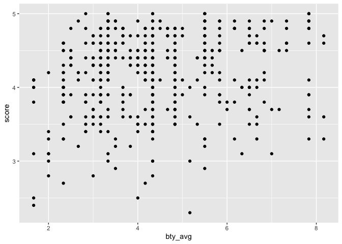

Lab 10 - Grading the professor, Pt. 2
================
John T. Bennett
March 23, 2022

### Load packages and data

``` r
library(tidyverse) 
library(broom)
library(openintro)
```

``` r
?evals
```

### Part 1: Simple linear regression

Q. Fit a linear model (one you have fit before): m_bty, predicting
average professor evaluation score based on average beauty rating
(bty_avg) only. Write the linear model, and note the R2 and the adjusted
R2. A. Our linear model (y=b0+b1x) will be y = 3.88 + .066 R-squared:
0.03502, Adjusted R-squared: 0.03293

``` r
m_bty.lm <- lm(score ~ bty_avg, data = evals)
summary(m_bty.lm)
```

    ## 
    ## Call:
    ## lm(formula = score ~ bty_avg, data = evals)
    ## 
    ## Residuals:
    ##     Min      1Q  Median      3Q     Max 
    ## -1.9246 -0.3690  0.1420  0.3977  0.9309 
    ## 
    ## Coefficients:
    ##             Estimate Std. Error t value Pr(>|t|)    
    ## (Intercept)  3.88034    0.07614   50.96  < 2e-16 ***
    ## bty_avg      0.06664    0.01629    4.09 5.08e-05 ***
    ## ---
    ## Signif. codes:  0 '***' 0.001 '**' 0.01 '*' 0.05 '.' 0.1 ' ' 1
    ## 
    ## Residual standard error: 0.5348 on 461 degrees of freedom
    ## Multiple R-squared:  0.03502,    Adjusted R-squared:  0.03293 
    ## F-statistic: 16.73 on 1 and 461 DF,  p-value: 5.083e-05

``` r
p <- ggplot(evals, aes(bty_avg, score))
p + geom_point()
```

<!-- -->

### Part 2: Multiple linear regression

Q2. Fit a linear model (one you have fit before): m_bty_gen, predicting
average professor evaluation score based on average beauty rating
(bty_avg) and gender. Write the linear model, and note the R2 and the
adjusted R2. A. Our linear model will be y(score) = 3.75 + 0.07 x
bty_avg + 0.17 x gendermale R-squared: 0.05912, Adjusted R-squared:
0.05503

``` r
m_bty_gen.lm <- lm(score ~ bty_avg + gender, data = evals)
summary(m_bty_gen.lm)
```

    ## 
    ## Call:
    ## lm(formula = score ~ bty_avg + gender, data = evals)
    ## 
    ## Residuals:
    ##     Min      1Q  Median      3Q     Max 
    ## -1.8305 -0.3625  0.1055  0.4213  0.9314 
    ## 
    ## Coefficients:
    ##             Estimate Std. Error t value Pr(>|t|)    
    ## (Intercept)  3.74734    0.08466  44.266  < 2e-16 ***
    ## bty_avg      0.07416    0.01625   4.563 6.48e-06 ***
    ## gendermale   0.17239    0.05022   3.433 0.000652 ***
    ## ---
    ## Signif. codes:  0 '***' 0.001 '**' 0.01 '*' 0.05 '.' 0.1 ' ' 1
    ## 
    ## Residual standard error: 0.5287 on 460 degrees of freedom
    ## Multiple R-squared:  0.05912,    Adjusted R-squared:  0.05503 
    ## F-statistic: 14.45 on 2 and 460 DF,  p-value: 8.177e-07

Q3. Interpret the slope and intercept of m_bty_gen in context of the
data. A. Slope bty_avg 0.07. All else held constant, for each unit
increase in bty_ave, we would expect the eval score to be higher, on
average, by 0.07 points. Slope gendermale 0.17. All else held constant,
males receive higher eval scores, on average, by 0.17 points. Intercept
3.74. Females with 0 bty-ave are expected to have an eval score of 3.74,
on average. (A zero bty-ave doesn’t make sense in context.)

Q4. What percent of the variability in score is explained by the model
m_bty_gen. A. Roughly 6 percent of the variability in score is explained
by this model.

Q5. What is the equation of the line corresponding to just male
professors? A. The linear model will be y(score) = 3.75 + 0.07 x
bty_avg + 0.17 x gendermale.

Q6. For two professors who received the same beauty rating, which gender
tends to have the higher course evaluation score? A. All else held
constant, males receive higher eval scores, on average, by 0.17 points.
We get this from our Slope gendermale data 0.17.

Q7. How does the relationship between beauty and evaluation score vary
between male and female professors? A. This question appears to be
asking for an interaction effect.

`{r Part2.7} eval_interaction <- linear_reg() %>% set_engine("lm") %>% fit(score ~ bty_ave * gender, data = eval) tidy(eval_interaction)`
\[Note: could not find function fit\]

Q8. How do the adjusted R2 values of m_bty_gen and m_bty compare? What
does this tell us about how useful gender is in explaining the
variability in evaluation scores when we already have information on the
beauty score of the professor. A. m_bty_gen includes the gender/bty_ave
interaction, and this increases adjusted R2 (.055), so the model with
the interactions explains more of the variance in eval score than the
model with bty_ave alone (.033).

``` r
glance(m_bty_gen.lm)$adj.r.squared
```

    ## [1] 0.05503202

``` r
glance(m_bty.lm)$adj.r.squared
```

    ## [1] 0.03292903

Q9. Compare the slopes of bty_avg under the two models (m_bty and
m_bty_gen). Has the addition of gender to the model changed the
parameter estimate (slope) for bty_avg? A. Yes, the addition of gender
to the bty_gen model increased the slope of bty_avg: 1) m_bty. Slope of
bty_avg (0.066). 2) m_bty_gen. Slope of bty_avg (0.074).

Q10. Create a new model called m_bty_rank with gender removed and rank
added in. Write the equation of the linear model and interpret the
slopes and intercept in context of the data. A. Our linear model will be
y(score) = 3.98 + 0.07 x bty_avg - 0.16 x ranktenure track - 0.13 x
ranktenured.

Slope bty_avg 0.07. All else held constant, for each unit increase in
bty_ave, we would expect the eval score to be higher, on average, by
0.07 points. Slope ranktenure track (-0.16). All else held constant,
those on tenure track receive lower eval scores, on average, by 0.16
points. Slope ranktenured (-0.13). All else held constant, those tenured
receive lower eval scores, on average, by 0.13 points. Intercept 3.98.
Those in the rank of “teaching”, with a 0 bty-ave, are expected to have
an eval score of 3.98, on average. (A zero bty-ave doesn’t make sense in
this context.)

``` r
m_bty_rank.lm <- lm(score ~ bty_avg + rank, data = evals)
summary(m_bty_rank.lm)
```

    ## 
    ## Call:
    ## lm(formula = score ~ bty_avg + rank, data = evals)
    ## 
    ## Residuals:
    ##     Min      1Q  Median      3Q     Max 
    ## -1.8713 -0.3642  0.1489  0.4103  0.9525 
    ## 
    ## Coefficients:
    ##                  Estimate Std. Error t value Pr(>|t|)    
    ## (Intercept)       3.98155    0.09078  43.860  < 2e-16 ***
    ## bty_avg           0.06783    0.01655   4.098 4.92e-05 ***
    ## ranktenure track -0.16070    0.07395  -2.173   0.0303 *  
    ## ranktenured      -0.12623    0.06266  -2.014   0.0445 *  
    ## ---
    ## Signif. codes:  0 '***' 0.001 '**' 0.01 '*' 0.05 '.' 0.1 ' ' 1
    ## 
    ## Residual standard error: 0.5328 on 459 degrees of freedom
    ## Multiple R-squared:  0.04652,    Adjusted R-squared:  0.04029 
    ## F-statistic: 7.465 on 3 and 459 DF,  p-value: 6.88e-05

### Part 3: The search for the best model

Going forward, only consider the following variables as potential
predictors: rank, ethnicity, gender, language, age, cls_perc_eval,
cls_did_eval, cls_students, cls_level, cls_profs, cls_credits, bty_avg.

Q11. Which variable, on its own, would you expect to be the worst
predictor of evaluation scores? Why? Hint: Think about which variable
would you expect to not have any association with the professor’s score.
A. I would expect “cls_did_eval” to be the worst predictor because it is
an absolute number, which is probably not very meaningful given
variations in class size.

Q12. Check your suspicions from the previous exercise. Include the model
output for that variable in your response. A. As expected, cls_did_eval
is a very weak predictor, explaining only a small fraction of a percent
of the variation in eval scores. Our linear model will be y(score) =
4.14 + 0.0008 x cls_did_eval.

``` r
m_dideval.lm <- lm(score ~ cls_did_eval, data = evals)
summary(m_dideval.lm)
```

    ## 
    ## Call:
    ## lm(formula = score ~ cls_did_eval, data = evals)
    ## 
    ## Residuals:
    ##     Min      1Q  Median      3Q     Max 
    ## -1.8545 -0.3595  0.1303  0.4269  0.8485 
    ## 
    ## Coefficients:
    ##               Estimate Std. Error t value Pr(>|t|)    
    ## (Intercept)  4.1469347  0.0325682 127.331   <2e-16 ***
    ## cls_did_eval 0.0007589  0.0005616   1.351    0.177    
    ## ---
    ## Signif. codes:  0 '***' 0.001 '**' 0.01 '*' 0.05 '.' 0.1 ' ' 1
    ## 
    ## Residual standard error: 0.5434 on 461 degrees of freedom
    ## Multiple R-squared:  0.003946,   Adjusted R-squared:  0.001786 
    ## F-statistic: 1.827 on 1 and 461 DF,  p-value: 0.1772

Q13. Suppose you wanted to fit a full model with the variables listed
above. If you are already going to include cls_perc_eval and
cls_students, which variable should you not include as an additional
predictor? Why? A. We should not include cls_did_eval. The
“cls_did_eval” variable would be redundant, once we take into account
ls_perc_eval and cls_students.

Q14. Fit a full model with all predictors listed above (except for the
one you decided to exclude) in the previous question. A. This gives us
Multiple R-squared: 0.1635, Adjusted R-squared: 0.1412.

``` r
m_allpreds.lm <- lm(score ~ bty_avg + rank + ethnicity + gender + language + age + cls_perc_eval + cls_students + cls_level + cls_profs + cls_credits, data = evals)
summary(m_allpreds.lm)
```

    ## 
    ## Call:
    ## lm(formula = score ~ bty_avg + rank + ethnicity + gender + language + 
    ##     age + cls_perc_eval + cls_students + cls_level + cls_profs + 
    ##     cls_credits, data = evals)
    ## 
    ## Residuals:
    ##      Min       1Q   Median       3Q      Max 
    ## -1.84482 -0.31367  0.08559  0.35732  1.10105 
    ## 
    ## Coefficients:
    ##                         Estimate Std. Error t value Pr(>|t|)    
    ## (Intercept)            3.5305036  0.2408200  14.660  < 2e-16 ***
    ## bty_avg                0.0612651  0.0166755   3.674 0.000268 ***
    ## ranktenure track      -0.1070121  0.0820250  -1.305 0.192687    
    ## ranktenured           -0.0450371  0.0652185  -0.691 0.490199    
    ## ethnicitynot minority  0.1869649  0.0775329   2.411 0.016290 *  
    ## gendermale             0.1786166  0.0515346   3.466 0.000579 ***
    ## languagenon-english   -0.1268254  0.1080358  -1.174 0.241048    
    ## age                   -0.0066498  0.0030830  -2.157 0.031542 *  
    ## cls_perc_eval          0.0056996  0.0015514   3.674 0.000268 ***
    ## cls_students           0.0004455  0.0003585   1.243 0.214596    
    ## cls_levelupper         0.0187105  0.0555833   0.337 0.736560    
    ## cls_profssingle       -0.0085751  0.0513527  -0.167 0.867458    
    ## cls_creditsone credit  0.5087427  0.1170130   4.348  1.7e-05 ***
    ## ---
    ## Signif. codes:  0 '***' 0.001 '**' 0.01 '*' 0.05 '.' 0.1 ' ' 1
    ## 
    ## Residual standard error: 0.504 on 450 degrees of freedom
    ## Multiple R-squared:  0.1635, Adjusted R-squared:  0.1412 
    ## F-statistic: 7.331 on 12 and 450 DF,  p-value: 2.406e-12

Q15. Using backward-selection with adjusted R-squared as the selection
criterion, determine the best model. You do not need to show all steps
in your answer, just the output for the final model. Also, write out the
linear model for predicting score based on the final model you settle
on. A. Adjusted R-squared: 0.14 Our linear model will be y(score) =
3.53 + 0.06 x bty_avg + 0.19 x ethnicity + 0.18 x gender -0.01 x age +
0.006 x cls_perc_eval + .51 x cls_credits.

``` r
m_bestmod.lm <- lm(score ~ bty_avg + ethnicity + gender + age + cls_perc_eval + cls_credits, data = evals)
summary(m_bestmod.lm)
```

    ## 
    ## Call:
    ## lm(formula = score ~ bty_avg + ethnicity + gender + age + cls_perc_eval + 
    ##     cls_credits, data = evals)
    ## 
    ## Residuals:
    ##      Min       1Q   Median       3Q      Max 
    ## -1.90305 -0.32025  0.08687  0.37799  1.06885 
    ## 
    ## Coefficients:
    ##                        Estimate Std. Error t value Pr(>|t|)    
    ## (Intercept)            3.409832   0.202120  16.870  < 2e-16 ***
    ## bty_avg                0.064891   0.016353   3.968 8.41e-05 ***
    ## ethnicitynot minority  0.240897   0.071151   3.386 0.000771 ***
    ## gendermale             0.182259   0.049942   3.649 0.000293 ***
    ## age                   -0.005087   0.002610  -1.949 0.051873 .  
    ## cls_perc_eval          0.005107   0.001440   3.547 0.000430 ***
    ## cls_creditsone credit  0.532266   0.104448   5.096 5.09e-07 ***
    ## ---
    ## Signif. codes:  0 '***' 0.001 '**' 0.01 '*' 0.05 '.' 0.1 ' ' 1
    ## 
    ## Residual standard error: 0.5038 on 456 degrees of freedom
    ## Multiple R-squared:  0.153,  Adjusted R-squared:  0.1419 
    ## F-statistic: 13.73 on 6 and 456 DF,  p-value: 2.322e-14

Q16. Interpret the slopes of one numerical and one categorical predictor
based on your final model. A. Numerical- cls_perc_eval. All else held
constant, a one unit increase in percent who completed evaluation is
associated with an increase of .01 points on eval score. Categorical-
gender. All else held constant, being male is associated with an
increase of .18 points on eval score.

Q17. Based on your final model, describe the characteristics of a
professor and course at University of Texas at Austin that would be
associated with a high evaluation score. A. This would be a younger,
non-minority male, teaching a one-credit course where a relatively large
percent of students completed their evaluations.

Q18. Would you be comfortable generalizing your conclusions to apply to
professors generally (at any university)? Why or why not? A. The fact
that the one-credit course carries so much weight in the evals leads me
to hesitate in applying my conclusions broadly. For instance, younger,
non-minority males teaching a multi-credit course might have completely
different eval scores. In other words, the high evaluation score at the
University of Texas seems to be overly-dependent on teaching a
single-credit course. The characteristics of those courses, and the
students who take them, would need to be clarified substantially.

…
